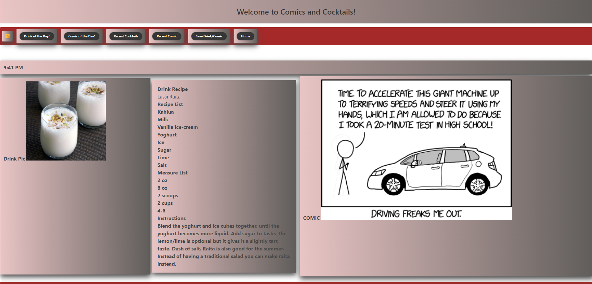

# Comics and Cocktails

## Purpose

Comics and Cocktails is a web application that allows individuals 21 years and older to search for recipes for alcoholic beverages as well as to read an amusing comic, with the intention of enabling that individual to unwind from a potentially stressful endeavor.  This application is meant for adults only; a generic disclaimer has been added for protection of the founding creators of Comics and Cocktails.

## Built With
* HTML
* CSS
* jQuery
* Bulma

## Website

[Live website link](https://perfect-perfect.github.io/comics-and-cocktails/)

[Live github repo link](https://github.com/perfect-perfect/comics-and-cocktails)

## Image

# Made By:
Gilberto Covarrubias, Duvalier Johnson, Michael Monihan, Criste Phillips, Savannah Polcen